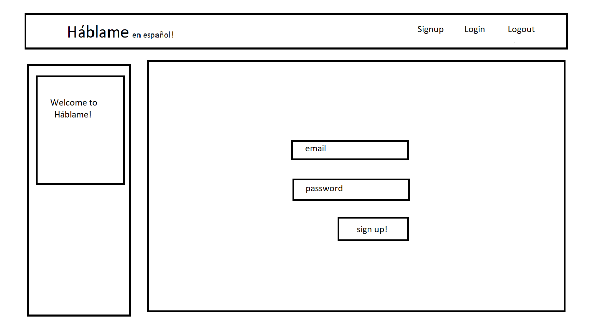
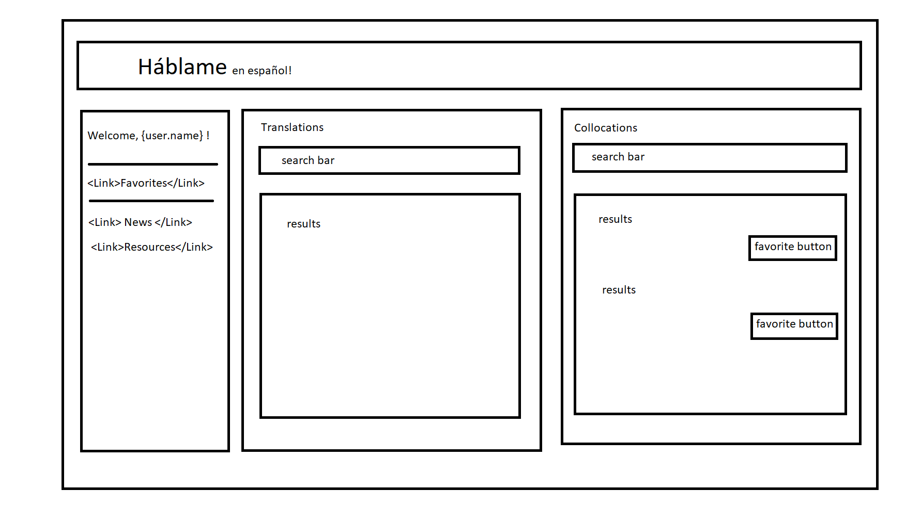
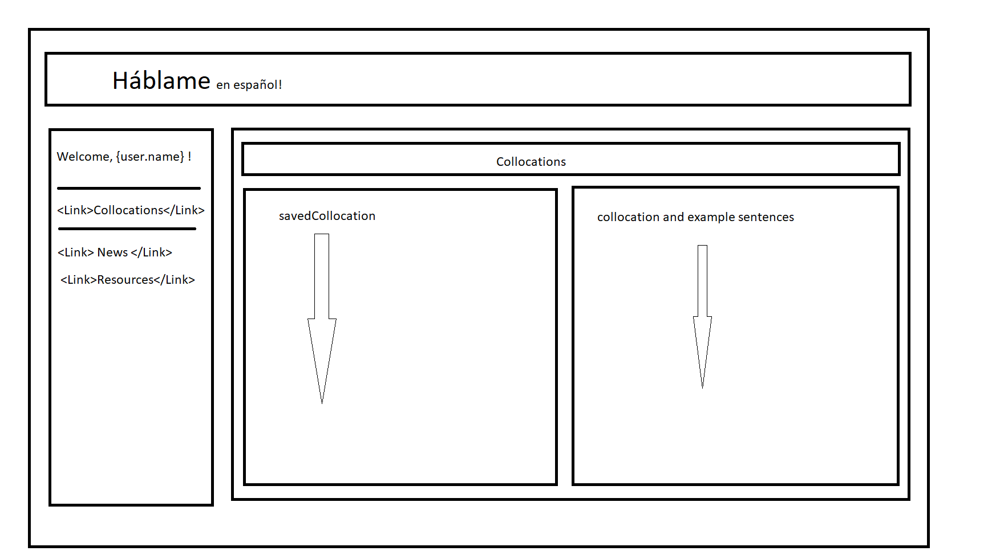
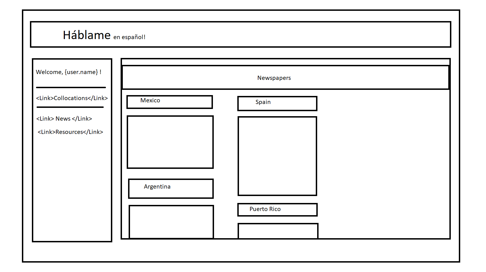
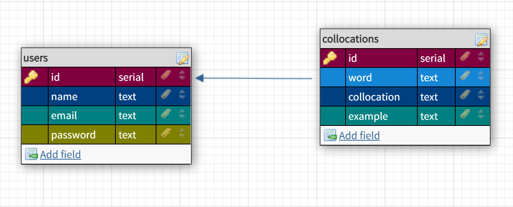
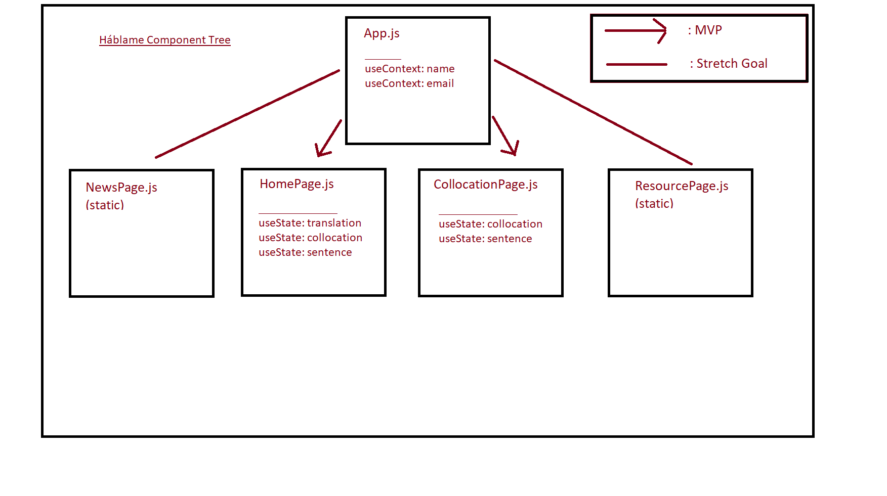

# Unit 3 Solo Project

## Overview ##

Háblame is a resource for learners of Spanish that pulls resources from Merriam Webster's dictionaryAPI and Linguatool from RapidAPI to look up translations as well as Spanish collocations and example sentences for those phrases. Users can save collocations they find useful for later reference.

## WireFrames ##

-- Stretch Goal Pages --

## ERD ##

## Component Tree ##

## Backend Routes Inventory ##

- app.post('/users', ...)                 // create user 
- app.post('/users/login', ...)           // login user
- app.get('/words', ...)                  // search translations
- app.get('/collocations', ...)           // search collocations
- app.post('/users/collocation', ...)     // save collocation
- app.get('/users/collocation', ...)      // get saved collocation(s)
- app.delete('/users/collocation', ...)   // delete collocation

## User Stories ##

- On landing page, I can either sign up or login
- On the home page, I see a nav bar on the left, a search tool in the middle to look up word definitions in Spanish, and a separate search tool on the right to look up collocations for specific words in Spanish
- On the home page, I can log out by clicking a button in the nav bar
- In the collocations pane of the home page, I can save specific search results to my account via a button
- On the home page, I can access my saved collocations via a link in the nav bar
- On the collocations page, I can see a list of my saved collocations, if any
- On the collocations page, I can click on a saved collocation and the example sentence will appear on the right
- In the list of saved collocations, I can delete a specific one via a button next to it

## MVP Checklist ##
- Users can sign up, login, and logout
- Users can use the dictionaryAPI to search for Spanish translations of English words
- Users can use the linguatools API to search collocations for Spanish words
- Users can save collocation-exampleSentence pairs to their profile
- Users can access their saved collocations via the navigation bar
- When users click on one of their saved collocations, the paired example sentence will appear
- Users can delete saved collocations from their profile

## Stretch Goals ##

- Use .env for backend URL
- Verify user login
- Create a static News Page that I can personally update throughout time
- Create a static Resources Page that I can personally update throughout time
- (For after the SEIR) Find APIs for other languages and create the same functionality this app has for students of those languages